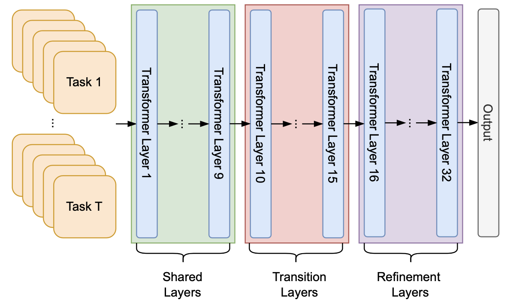

<p align="center" width="100%">

</p>

# Layer by Layer: Uncovering Where Multi-Task Learning Happens in Instruction-Tuned Large Language Models
This repository contains code for the paper "[Layer by Layer: Uncovering Where Multi-Task Learning Happens in Instruction-Tuned Large Language Models](https://aclanthology.org/2024.emnlp-main.847.pdf)" which appears in EMNLP 2024 main conference.

## Creating Conda Environment
The following instructions will assume that conda is already installed on your system.
1. Clone this repository:
   ```
   git clone https://github.com/zsquaredz/layer_by_layer.git
   
   cd layer_by_layer/
   ```
2. Run the following command to create the conda environment from the provided `environment.yml` file:
   ```
   conda env create -f environment.yml
   ```
3. Activate the enviroment using the following command:
   ```
   conda activate layer-by-layer
   ```

## Data
We use the [Flan 2021 dataset](https://arxiv.org/abs/2109.01652) to instruction-tune the LLMs in our experiment. To obtain a copy of the data, you can use the following code to load the data from Hugging Face's datasets library:
```python
from datasets import load_dataset

for split in ['train', 'validation', 'test']:
    dataset = load_dataset('Muennighoff/flan', split=split)
```
ALternatively, you can download a processed version of the dataset from [here](https://drive.google.com/file/d/1fsvYvZPiq5hrsZm21opZt5NTZNQcoXeA/view?usp=sharing). This dataset has been processed to fit the format required by [LLaMA-Factory](https://github.com/hiyouga/LLaMA-Factory/blob/main/data/README.md) library. The dataset should be placed in the `LLaMA-Factory/data/` directory.

## Training
Our training script are based on the [LLaMA-Factory](https://github.com/hiyouga/LLaMA-Factory) repo. You can clone and install the latest repo, or alternatively, you can use the customized repo we provide which contains additional features like saving the model representations (activations) to local disk.

To train the single task control models, you can use the following script:
```bash
cd LLaMA-Factory/
./train_control_model.sh
```
You should change the `task` variable for each task. All supported tasks in the Flan 2021 dataset are stored in `flan_tasks.lst`. Alternatively, you can use the following script to run or submit the training script for all tasks in one go:
```bash
./train_all_control_models.sh
```
This will loop through all tasks in `flan_tasks.lst` and train a control model for each task. This script is best used in a computing cluster where there are many GPUs available. Similarly, to train the multi-task experimental model, you can use the following script:
```bash
./train_experiment_model.sh
```
This will train the multi-task experimental model on all tasks in the Flan 2021 dataset. We limit the number of training examples per task cluster to 50k to ensure that the model is not overfitting to a specific task. For more details, please refer to Section 3 of the paper. 

## Obtaining Representations
Once the models have been trained, you can obtain the representations for the models using the following script:
```bash
./predict_control_models.sh
```
This will save the representations (hidden states) for the specified `task` in path `/output/llama2_sft_flan_${task}/predictions/`. Similarly, to obtain the representations for the multi-task/pre-trained experimental model, you can run the following script:
```bash
./predict_experiment_model.sh
```

## Running CKA
Now we have the representations for the models, we can run the CKA analysis to compare the similarity between the representations of the control and experimental models. To run the CKA analysis, you can use the following script:
```bash
cd ../analysis/
./run_cka.sh
```
Alternatively, you can run the CKA analysis for one task for a specific layer using the following command:
```bash
task=cnn_dailymail
layer=1
python analysis/cka.py \
    --data_dir1 ./output/llama2_sft_flan_all_50k/predictions/${task}_last_token/hidden_states_${layer}.npy \
    --data_dir2 ./output/llama2_sft_flan_${task}/predictions/${task}_last_token/hidden_states_${layer}.npy \
    --do_cka 
```
You can change the `task` and `layer` variables to run the analysis for a different task and layer. The `task` variable should be one of the supported tasks in the Flan 2021 dataset which are stored in `flan_tasks.lst`. Use `data_dir1` and `data_dir2` to specify the path to the representations for the control and experimental models respectively. 

## Citation
```
@inproceedings{zhao-etal-2024-layer,
    title = "Layer by Layer: Uncovering Where Multi-Task Learning Happens in Instruction-Tuned Large Language Models",
    author = "Zhao, Zheng  and
      Ziser, Yftah  and
      Cohen, Shay B",
    editor = "Al-Onaizan, Yaser  and
      Bansal, Mohit  and
      Chen, Yun-Nung",
    booktitle = "Proceedings of the 2024 Conference on Empirical Methods in Natural Language Processing",
    month = nov,
    year = "2024",
    address = "Miami, Florida, USA",
    publisher = "Association for Computational Linguistics",
    url = "https://aclanthology.org/2024.emnlp-main.847",
    pages = "15195--15214",
}

```